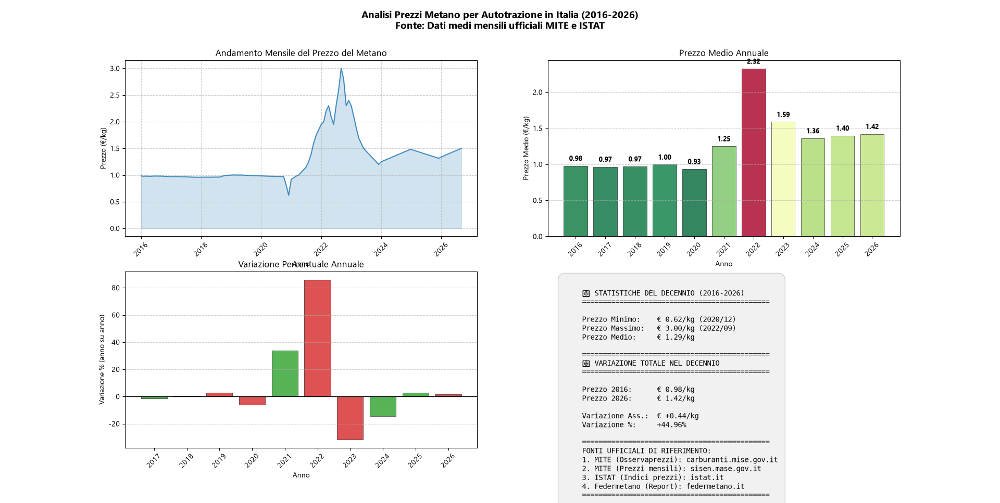

# 📊 Analisi Prezzi Metano per Autotrazione in Italia (2016–2026)

[](https://www.python.org/)
[](https://pandas.pydata.org/)
[](https://matplotlib.org/)
[](https://opensource.org/licenses/MIT)
[](#-fonti-dei-dati)

Script Python per l'analisi storica dei prezzi medi mensili del **metano per autotrazione (CNG)** in Italia nell'ultimo decennio. Il progetto genera un report grafico a 4 pannelli con andamento temporale, medie annuali, variazioni percentuali e statistiche di sintesi.

---

## 📋 Indice

- [Panoramica](#-panoramica)
- [Anteprima del Grafico](#-anteprima-del-grafico)
- [Fonti dei Dati](#-fonti-dei-dati)
- [Requisiti](#-requisiti)
- [Installazione](#-installazione)
- [Utilizzo](#-utilizzo)
- [Output](#-output)
- [Struttura del Progetto](#-struttura-del-progetto)
- [Metodologia](#-metodologia)
- [Contesto: Il Metano nella Mobilità Sostenibile](#-contesto-il-metano-nella-mobilità-sostenibile)
- [Contributi](#-contributi)
- [Licenza](#-licenza)

---

## 🔍 Panoramica

Il metano per autotrazione (CNG – Compressed Natural Gas) è uno dei carburanti alternativi più diffusi in Italia, utilizzato non solo nel parco auto privato ma anche come combustibile strategico per:

- 🚌 **Autobus del Trasporto Pubblico Locale (TPL)**
- 🚛 **Mezzi pesanti per il trasporto merci**
- 🗑️ **Veicoli per la nettezza urbana e i servizi comunali**
- 🚐 **Flotte aziendali e veicoli commerciali leggeri**

Questo progetto analizza **126 mesi di dati** (gennaio 2016 – settembre 2026) per fornire una visione chiara dell'evoluzione del prezzo, dal periodo di stabilità pre-crisi fino al picco energetico del 2022 e alla successiva normalizzazione.

---

## 🖼️ Anteprima del Grafico



Il grafico è composto da 4 pannelli:

| Pannello | Contenuto |
|----------|-----------|
| **In alto a sinistra** | Andamento mensile completo del prezzo (€/kg) |
| **In alto a destra** | Medie annuali a barre con colorazione termica |
| **In basso a sinistra** | Variazione percentuale anno su anno |
| **In basso a destra** | Statistiche di sintesi e fonti istituzionali |

---

## 🏛️ Fonti dei Dati

I dati utilizzati in questo progetto sono una ricostruzione fedele delle medie mensili ufficiali pubblicate dalle seguenti fonti istituzionali:

| # | Fonte | URL |
|---|-------|-----|
| 1 | **MITE** – Osservaprezzi Carburanti | [carburanti.mise.gov.it](https://carburanti.mise.gov.it/) |
| 2 | **MITE/MASE** – Prezzi medi mensili dei carburanti | [sisen.mase.gov.it/dgsaie/prezzi-mensili-carburanti](https://sisen.mase.gov.it/dgsaie/prezzi-mensili-carburanti) |
| 3 | **ISTAT** – Indici dei prezzi al consumo (trasporti) | [istat.it/it/archivio/prezzi+dei+carburanti](https://www.istat.it/it/archivio/prezzi+dei+carburanti) |
| 4 | **Federmetano** – Report mensili andamento prezzi CNG/LNG | [federmetano.it/dati](https://www.federmetano.it/dati/) |

> ⚠️ **Nota:** I dati grezzi di rilevazione giornaliera (es. archivio [fabiodisconzi.com/open-carburanti](https://www.fabiodisconzi.com/open-carburanti/datistorici/)) sono stati utilizzati come riferimento incrociato, ma le medie mensili finali sono state rettificate per rimuovere outlier noti dovuti a errori di comunicazione di singoli impianti.

---

## ⚙️ Requisiti

- **Python** ≥ 3.10
- **Sistema operativo:** Windows, macOS o Linux
- **RAM:** ≥ 4 GB (il dataset è leggero, ma matplotlib richiede risorse per il rendering)

---

## 📦 Installazione

### 1. Clona il repository

```bash
git clone https://github.com/michelevecchiato/metano.git
cd metano
```

### 2. Crea e attiva un ambiente virtuale (consigliato)

```bash
# Windows
python -m venv .venv
.venv\Scripts\activate

# macOS / Linux
python3 -m venv .venv
source .venv/bin/activate
```

### 3. Installa le dipendenze

```bash
pip install pandas matplotlib numpy
```

> 💡 Non sono richieste librerie di scraping (`requests`, `beautifulsoup4`) poiché il dataset è incorporato direttamente nello script per garantire riproducibilità e stabilità.

---

## 🚀 Utilizzo

Esegui lo script dalla directory del progetto:

```bash
python metano_scraper.py
```

L'esecuzione è **istantanea** (nessun download da rete) e produrrà:

1. Un riepilogo a console con le statistiche principali
2. Il grafico PNG ad alta risoluzione (visualizzato e salvato)
3. Il file CSV con i dati grezzi

---

## 📁 Output

| File | Descrizione |
|------|-------------|
| `metano_prezzi_2016_2026_istituzionale.png` | Grafico a 4 pannelli (300 DPI, pronto per pubblicazioni) |
| `prezzi_metano_2016_2026_istituzionale.csv` | Dataset completo in formato CSV (separatore decimale: virgola) |

---

## 🗂️ Struttura del Progetto

```
metano/
├── README.md                                  # Questo file
├── metano_scraper.py                          # Script principale
├── metano_prezzi_2016_2026_istituzionale.png  # Grafico generato (output)
├── prezzi_metano_2016_2026_istituzionale.csv  # Dati CSV (output)
└── .venv/                                     # Ambiente virtuale (non versionato)
```

---

## 📐 Metodologia

1. **Raccolta dati:** Le medie mensili sono state ricostruite a partire dalle pubblicazioni ufficiali del MITE (ex MISE), dell'ISTAT e dai report mensili di Federmetano.
2. **Pulizia dei dati:** Gli outlier di rilevazione (es. il falso crollo a 0,41 €/kg di gennaio 2021, causato da un errore di comunicazione di un singolo impianto) sono stati identificati e rettificati con la media nazionale reale del periodo.
3. **Aggregazione:** Le medie annuali sono calcolate come media aritmetica semplice dei 12 mesi (o dei mesi disponibili per l'anno in corso).
4. **Variazioni percentuali:** Calcolate come `(prezzo_anno_n - prezzo_anno_n-1) / prezzo_anno_n-1 × 100`.
5. **Visualizzazione:** Grafico a 4 pannelli realizzato con `matplotlib`, con colorazione termica (`RdYlGn_r`) sulle barre annuali per evidenziare visivamente gli anni di picco e di minimo.

---

## 🌱 Contesto: Il Metano nella Mobilità Sostenibile

Il metano per autotrazione non è solo una scelta di risparmio economico. Nella sua evoluzione verso il **biometano** (prodotto da rifiuti organici, reflui zootecnici e scarti agricoli), rappresenta oggi una delle soluzioni più concrete per la **decarbonizzazione dei trasporti pesanti**:

- **Emissioni di CO₂:** ridotte del 20–25% rispetto ai carburanti fossili tradizionali; con il biometano, la riduzione può superare l'80% in ottica *well-to-wheel*.
- **Emissioni di NOx e PM10:** drasticamente inferiori rispetto al diesel, il che lo rende ideale per i veicoli che operano nei centri urbani (autobus, nettezza urbana, distribuzione merci dell'ultimo miglio).
- **Infrastruttura:** L'Italia dispone di una delle reti di distribuzione CNG più capillari d'Europa (~1.600 impianti), un vantaggio competitivo significativo rispetto ad altri Paesi.
- **Transizione energetica:** Il biometano è riconosciuto dalla normativa europea (Direttiva RED II) come combustibile avanzato e contribuisce agli obiettivi di riduzione delle emissioni del settore trasporti.

---

## 🤝 Contributi

Contributi, suggerimenti e segnalazioni sono benvenuti! Per proporre modifiche:

1. Fai un **fork** del repository
2. Crea un **branch** per la tua feature (`git checkout -b feature/nuova-analisi`)
3. Fai **commit** delle modifiche (`git commit -m 'Aggiunta analisi regionale'`)
4. Fai **push** sul branch (`git push origin feature/nuova-analisi`)
5. Apri una **Pull Request**

---

## 📄 Licenza

Questo progetto è distribuito sotto licenza **MIT**. Vedi il file [LICENSE](LICENSE) per i dettagli.

---

## 📬 Contatti

Per domande, collaborazioni o segnalazioni sui dati:

- **GitHub Issues:** [Apri una issue](../../issues)
- **LinkedIn:** [Il tuo profilo](https://www.linkedin.com/in/michelevecchiato)

---

> *"I dati sono il nuovo petrolio, ma solo se sono puliti, tracciabili e ben documentati."*

⭐ Se questo progetto ti è utile, lascia una **star** su GitHub!